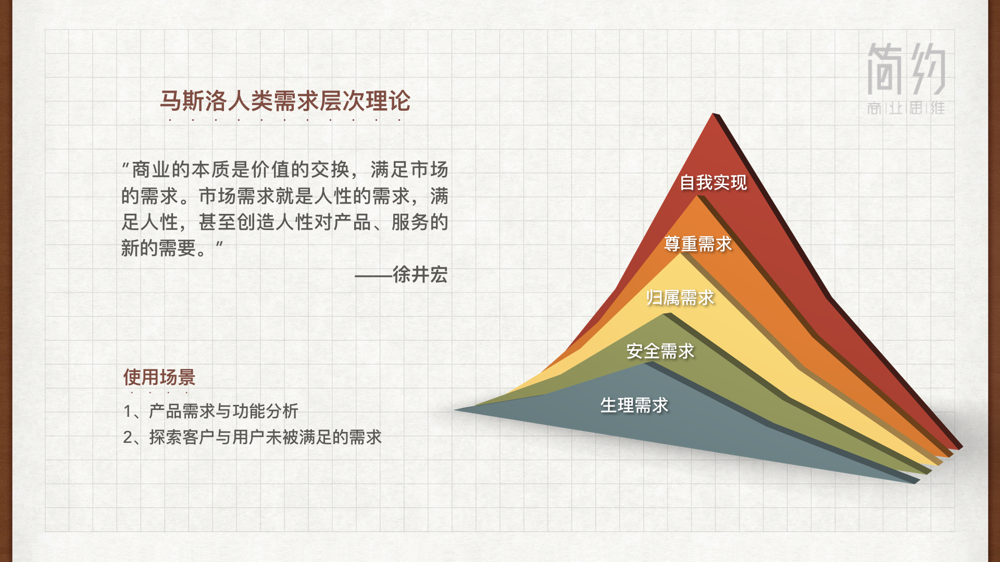

:audio{src="http://jianyuebookmusic.test.upcdn.net/01.%E5%95%86%E4%B8%9A%E7%9A%84%E6%9C%AC%E8%B4%A8-%E4%BA%A7%E5%93%81.mp3" controls="controls"}

【有趣的场景图】

各位同学大家好，有请徐井宏老师为大家讲授《简约商业思维》的缘起和第一课商业的本质。

【初心------】

&#x20;    这几年，创业越来越成为很多年轻人的选择，所以就有好多年轻人总会问我说：“徐老师，我想创业，那你觉得建议我做点什么？”在这个时候我就觉得我特别难回答，我给很多创业者回答，我说：“你要是都还不知道自己做些什么的时候，就先不要创业。”创业我觉得就是实质上我们把我们每个人最擅长的东西变成一个市场的价值，然后换得我们所谓的成功或者回报。这几年呢，各种由于创业的兴起，各种的培训，各种的商业学说，都不断的涌现。我发现另一个问题就是把很多创业者都搞糊涂了，因为大家都讲什么颠覆、什么风口、什么这个这个、这个那个......然后，从组织的模式也提出了很多新的提法，但是我觉得，其实一个企业家或者是一个创业者，不是要把简单的问题去变得特别复杂，而是他能够去把复杂的东西变得特别的简单。所以我的简约商业思维实际就12个字：**把握本质，遵循常识，聚焦关键**。那我们要看到商业的本质是什么，看到企业的本质是什么，管理的本质是什么。然后，我们要真正的懂得商业世界的一些常识，不去违背这些常识。所以说创业，好多人创业有很多坑在里边走过，其实我发现大部分的坑其实都是对常识的不认知。很多坑其实都是可以避过的，当你避过这些坑的时候，那你可能就会走的快一点，走的顺一点，取得成功的概率就会大一点。所以这就是我想跟创业者们或者跟年轻人们来分享简约商业常识的这样的一个初衷，这样一个发心。从而来这个能够希望能够帮助年轻人更好的**认知世界、认知商业、认知自己**，能够更好的去创造价值，去获得成功。

【商业的起缘-------】

&#x20;   其实商业不是有人类就有了商业，商业是随着人类进化与发展而产生的。那早期的人类大家都知道，就是靠狩猎呀，靠后来的种植，那这样靠自给自足来生存和生活。那实际商业是跟两个方向的，叫做技术也好，或者叫做不断的发展也好，而产生的这两项。我觉得**一个叫交通，一个叫通讯**。那有了交通就使得物流产生了可能，有了通讯是人和人的联系产生了可能，当然我指的通讯不是说后来发明了电话，发明电之后，那可能有早期的鸽子来送信，篝火来通报消息，这都叫通讯。

&#x20;    交通也不是非指现在的集装箱，而是有船，有这个马车，这些就变成了可能。

【商业的本质------】

&#x20;  商业的本质实际是价值的交换，就是你创造的价值换来他创造的价值。最早也没有货币，其实最早的商业是物和物的交换，你有一个贝壳，它有一个石头，你觉得这石头拿来挺有用，他觉得贝壳拿来挺有用，你们俩就换了。进一步的进化有了货币，有了商店，才逐步的形成现代的商业。我讲商业的本质，其实我一直说商业也不要把它想的那么复杂，那主要就是我讲的三点：

&#x20;   **1.产品好、服务好：** 一个就是你有好的产品。这个好的产品不是我自己认为好，而是这个产品是市场认为好，是你所需要交换的，另一方他的需要。当然到今天因为服务业有高度发达，其实这就是人和其他一切的生物或者是物质的差异，就是人还有精神需求，所以又有了很多的服务的产生。所以，第一条就是产品或者服务必须是市场需求的，是市场觉得好，越好越有竞争力，其实就这么简单。所以好多小伙伴那时候问我说做什么？我说你能做出什么，你能做出什么比别人好，那你的东西可能就会得到市场的认可。

&#x20;  \*\*  2.效率高、成本低： \*\*那第二件事呢，我觉得做企业或者说我们在当代这样一个商业社会，你必须是效率高和成本低的，因为人们买东西也好，是需要希望花最少的钱能够买到最好的东西，这是每一个人的本质的需求。所谓的性价比，商品的品质或者它的这个质量除以价格就叫性价比，性价比越高，大家就觉得这个事情越好。所以我们现在的技术，你看无论是蒸汽机的发明，还是电的发明，还是计算机的发明，还是网络的应用，还是现在所谓的AI技术等等...... 这些技术在干嘛？就在干这两件事：通过这些技术让我们生产出来的产品成本越来越低。一个杯子，原来生产出来可能要十块钱，那现在可能五毛钱，那这个时候就好了，你卖两块钱，你赚一块五，原来十块钱你要卖两块钱，你亏八块。所以这就是竞争力的产生，就是你的成本比别人低。那同时你的效率要比别人高。同样是这件事，别人已经比你早一个月做出来了，那他就是先发优势，那你比他慢，你可能就处在竞争的不利地位。

&#x20;     \*\*3.传播准、快、广： \*\*那它的本质第三条就是传播，这就是现代商业的一个非常重要的事情，就是能够把我能够提供的价值，迅速、准确的传播到我希望的用户的认知之中，我们叫直达用户的心里。那过去我们都知道，在还没有现在这样一些技术的时候，广播、纸媒、电视，那现在有了自媒体，有了多媒体，有了多种多样的传播方式，哪种才是最适合你去传播的？它的检验，就是你是不是最快的、最准的、最广泛的，抵达了你所希望的那个客户人群。所以我觉得把这三条做好，基本上你的这个创业离成功就不远了。

【如何发现需求---------】

&#x20;   那我们刚才讲了，就是说商业的本质实际就是价值的交换，就是满足市场的需求，那我们现在就说市场的需求到底是什么。什么样的产品，什么样的服务才是市场真正需求的？那用我最简单的这个理念来讲，所谓的市场需求就是人性的需求，就是满足人性，甚至创造人性对服务、对产品的新的需要。那人性是什么？

&#x20;   其实这件事我们不要把它想的很复杂，我们去看婴儿就好了。因为当我们长大之后，可能我们增长了需求。但是婴儿是最有天性的，我们看小孩子他是一个怎么样的表达，我们会发现小孩子最核心的是两件事：一件事是**懒惰**，因为你不能去打扰他，他需要舒服。所以在他想睡觉的时候，你去干扰他，他就会哭，是吧？他想待着，你非得让他去干什么，他就不干，这是天性。大家不太愿意认这件事，但是实际懒惰就是人的天性之一。其实我们现在很多的新型商业都在满足这件事，比如外卖，为什么要外卖，是因为你懒，你不愿意自己做饭，甚至你不愿意下楼到那个小店里去买东西。你就坐在家里，一摁键东西都来了，那解决的就是你的懒惰问题。但是孩子还有另外一个天性，这个是比那个更重要的，就是**好奇**。这是人从一生下来就具备的天性，你看那个小孩儿，他睁开眼睛，他就在非常好奇的看着整个的世界。然后他觉得无聊了，他也会哭，然后无聊的时候怎么办，就拿一个玩具一晃，他就好了。还有一个就是他的好奇，当这个东西变成习惯他就不喜欢了，所以你这个玩具棒，他第一天觉得很好，第二天呢他觉得还行，到了第十天你给它玩具棒，他基本上没反应。这个时候他需要什么？需要你拿另一个小猫小狗的叫声，他又觉得挺好，是吧？所以小孩子的玩具你看他要不停的变换，他会有很多的玩具，当然这其中他会有某些偏好，这是我说的另外一个问题，就是兴趣。其实商业都在解决这些问题，所以蒸汽机为什么发明？为什么要发明机器？机器是干嘛的？替代人的体力劳动。我们说科技就是这样逐步进化来的，是因为人的体力劳动，要不是太累，要不甚至还达不到。所以第一次工业革命蒸汽机的发明，甚至包括第二次工业革命电的发明，都在解决这个问题，就是让人的体力劳动如何被机器所替代。我们看古代的人，那个时候最强大的人就是最有力量的人，所以你看《三国》的时候或者是《水浒》的时候打仗，都是一员大将冲出来，只要他能把对方干掉，那几乎就是胜利了。所以那时候的人，我们说八尺长矛也好，多大的兵器也好，那时候人的体力实际比现在厉害。我们现在人的体力其实在退化的，但是退化的同时，人的智力大脑在不断地更加发达，这就是人类的进化的一个过程。那为什么退化？就因为它不需要了。冷兵器时代全靠力量来进行，到热兵器你就会发现力量已经没有用了。大刀轮的多么的有力，他都可以在百米一枪就把你干掉。有了火药，那现在是人和人都碰不到了，现在的战争如果再发生，全是激光定位精准的导弹，直接在几米之内就可以精准的打到一个地方，所以这就是科技的发达。科技的发展，**第一件事就逐步的替代了人力，同时延展和增强了人的力量**。所以科技的发展在早期就是在解决这个问题，解决人的懒惰。新的各种各样产品的出现，在解决人的好奇问题。除了懒惰，可能人性还有一些其他的，比如说他希望很享受、很充实等等......所谓产品的好，所谓服务的好，就是能够让人性得到更大的满足，人们对美好的追求，人们对这个未知事物的探索，甚至情感的需要，所以现在文化产业也高度的发达。所以，就看看我们做的每一个产品是不是满足了人的天性，对这些东西的真正的需求，那它就是一个检验产品好与不好的一个标准。所以没有那么复杂，所以我讲，做产品大概四件事，你做到其中一件，基本你就可以做好。

&#x20;   第一叫\*\*“人无我有”\*\*。当然这个“我有”也得是市场需要的，别人没有就我有，那没办法，这个时候你就是垄断，你就是先行者。所以苹果最先做出了触摸屏的智能手机，那时候别人没有，只有我有。当别人有的时候。

&#x20;  第二句话，**“人有我优”**，我比别人好。你也有，但是我的比你好。

&#x20;  第三句话叫\*\*“人优我廉”\*\*，你也是这个质量，那我的比你的便宜。

&#x20;  四句话叫\*\*“人廉我特”\*\*，就是我独特。虽然我也不便宜，虽然我的质量和你差不多，但是我有某一个独特点是针对一个特别的群体所需要的。

&#x20;  这4点做到任何一点都可能带来你的成功，但是你说我都没有，那你就是一个很平庸的企业。最核心最核心的，我希望创业者们记住的就是：你要创业，你要做一件事情，无论做一个产品，一个服务，你要问自己，**我解决了市场的什么问题，我满足了市场什么需求**，然后我如何把我解决这个问题和我满足的事情做到最好。

【如何创造需求--------------】

&#x20;  创造需求是两个词，一个叫创造，一个叫需求，我们往往一谈创造需求，大家觉得是无中生有，其实不是的，首先还是人的需求，人的需求还是这样的。那比如我们说触摸屏的产生，人们都需要方便，原来我要打字，大家就认为打字是天经地义的，但是触摸屏的发明，使得让你的手指头不用原来的打字方式就可以很方便的完成这件事，但这件事依然是人天然的需求。使我更方便，更快捷，但是技术的发明可以把这些变成一个全新的创造，那我们这是2C了，我们还有业务，还有2B，2G。那比如2G，一个区域的管理，区域的管理是什么？就是让我的城市能够管理的更加有秩序，更加高效。那传统的可能一直也想不到，那我们很多新的发明，比如智慧城市的发明，可以把信息大量的收集，可以用数据来让所有的事情更加快捷。那比如智慧交通是什么？就是通过数据能够让道路得到最充分的利用，会及时的指出。我们现在会用到的gps是干嘛的？他不只是给你指路，他还告诉你，你走哪条路更便捷，那这都是过去我们想不到的。当没有这个技术的时候，我们会觉得只有这条路，只有这么走，一切按照习惯来。但是有了这些，它就会给你带来很多很多新的需求，然后让你认知了。这个技术就应用到了市场之中，就获得了它应有的回报。有人还有更高的需求，当他有了很多的认知之后，他会有精神的需求，这种精神的需求有些可以物化的，比如人希望自己高贵，希望自己优雅，希望自己能够被别人注意，所以就有了奢侈品，能够让你穿上这样的衣服，做一个这样的化妆，能够让别人对你更加关注，更加引人注目等等......这样的一些产品就产生了。所以大家都知道马斯洛需求的五个层面，当然我们最高层面还有第六层面叫超越自我，不是我们今天讨论的内容。所以随着人类的发展，随着每一个人消费能力的提升，他的需求在不断的变化，但是实际上所有的商业还依然脱不开这五个需求。

【教练解读-------------】

&#x20;  各位好，我是简约商业思维共创人张正明。徐井宏老师指出，商业的本质实际就是价值的交换，满足市场的需求，所谓市场的需求就是人性的需求，那我们如何更好的解析人性呢？马斯洛于1954年的书籍著作《动机与人格》中提出人类需求层次理论，其中包含了五类需求，可以更好的帮助我们去解析人性。

一、生理需求，这是人类最底层的需求，包括饥饿的时候需要食物，渴的时候需要饮水，身体需要衣物去保暖，居住需要居所，行需要交通。如果这些基本的生理需求得不到满足，人类的生存就成了问题。

二、安全需求，包含了生活与工作环境的安全，人生与生命安全，生活与财产的安全，家庭与个人的安全，如果对周遭的人事物感觉到威胁，就会变得紧张恐惧，惶恐不安。

三、社交需求，这包含了爱与被爱的需求。人人都希望爱别人，也渴望接受别人的爱。这里的爱包含着家人之间的亲密关系，伙伴之间的忠诚，信任等等归属感的需求。人都需要有归属于群体的感情，希望成为群体的一员，并相互关心照顾。

四、尊重的需求，这包含了内部尊重与外部尊重。内部尊重是指一个人希望在各种不同的情境当中展现出实力，工作能胜任感，充满信心、独立自主。外部尊重则是指，一个人希望有社会地位，受人尊重，高度评价。

五、自我实现需求，这个需求是实现个人理想抱负，即发挥个人能力，最大化自我实现需求是在努力实现自我的潜力，使自己成为更好的自己。例如不断的充实自我，持续成长、学习创新。当我们能够利用马斯洛人类需求层次理论更好的解析人性，那我们就能够有机会创造出更好的产品与服务，去满足客户与用户未满足的需求。

&#x20;    这边提供一个课后的思考题，我们如何能够利用马斯洛人类需求层次理论，分析我们目前核心客户群是否有未被满足的需求，并且从中识别新的产品或功能创新的机会？

&#x20;     商业的本质是要做到产品好与服务好，可是一个产品与服务的好坏不是我们说的算，而是用户说了算。我们可以从用户的角度，从三个维度来评价产品服务的好坏。

第一、是否有用我们的产品服务，是否能够帮用户真正的解决问题，能够排除他的痛点。

第二、用户是否感觉到好用，在使用产品服务的过程当中，他能感觉到它的便利性，舒适的感觉，甚至带给用户不一样刺激以及愉悦的感觉，这是好用的标准。

第三、我们的产品、服务是否能够符合人性，例如能够满足用户的懒惰，带给用户不一样的享受，满足他的好奇心、充实感等等。因此，所谓的产品好与服务好，一定是要站在用户的视角，带给他有用、好用以及爱用的感受，这样子才是一个真正的好产品及服务。

本节的思考题： 请站在用户的视角，利用产品与服务评价模型，评价我们所提供的产品与服务是否满足用户有用、好用以及爱用的目标，并且从中发现值得提升的地方。

扫码测试：

