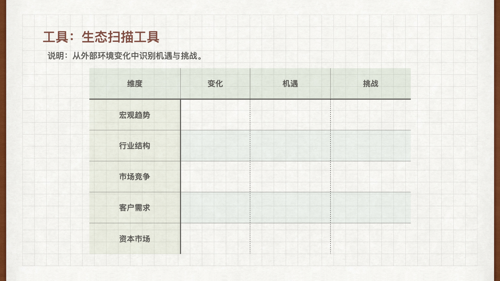

:audio{src="http://jianyuebookmusic.test.upcdn.net/06.%E4%BC%81%E4%B8%9A%E7%9A%84%E6%9C%AC%E8%B4%A8-%E6%88%98%E7%95%A5%E5%92%8C%E5%9B%9B%E4%B8%AA%E5%8A%9B%E9%87%8F.mp3" controls="controls"}

&#x20;   &#x20;

&#x20;    各位好，我是简约商业思维共创人张正明。本节课的题目是企业的本质，有请徐井宏老师。

&#x20;    说到制定战略也好，说到认知也好，我觉得和一个企业家或者和一个企业密切相关的大概有四方面的事情，创业者必须认知的四个力量。

&#x20;     第一个力量就叫做**科技的力量**。科技的力量在这个时代往下走尤其的重要，因为中国和整个的世界已经发展到了今天这个形态，其实在20年以前，30年以前，40年以前，它没有像今天这么重要。在那个时候，比如说我们中国改革开放之后，企业的前几代人，第一代人我称之为叫做主体是贸易，那个时候拿到批件就是财富。第二批人，房地产，92派，所以92派大部分都是房地产，拿到土地就是财富。第三批人，金融，拿到牌照就是财富。做保险，做信托。但是到了新的一代不行了，必须靠科技创新才能走的更远，才能真正的做出一个具有巨大价值的，具有无限前景的这样的一个好企业，所以科学技术在这个时代比以往任何一个时代都更加快速甚至爆炸式的发展，它已经到了令人眼花缭乱的一个程度。

&#x20;     我自己说，在十年前我想象力都想象不到，到2020年我们这只手机的演变，它已经变成了我们身体的一部分，虽然还叫 Phone，就是电话。手机原来就是有线到无线，其实过去是无线，有线的都在家里，在办公室里，无线走到哪里都能打，当年是大哥大。但是今天这只手机已经不是手机了，我们每个人用它打电话占我们对它使用的比例越来越少，但是我们在手机上的时间越来越多，所以这是一个巨大的甚至在当年都想象不出来的一个变化。那这个变化当然跟摩尔定律的真正的实现是有关的，跟科学技术的进一步的进展是有关的。所以现在它已经不只是一个通话的工具，他就成了我们身体的一部分，我们绝大多数信息的获取，绝大多数的社交，甚至支付购买；我们的生活，点一个键外卖就把饭菜给你送来了，其实人已经离不开。所以科技还不仅仅是智能技术，那比如生物技术、材料技术、仿真技术等等，在未来还将产生什么样的影响，具有着特别特别大的想象的空间。

&#x20;    但是技术运用到我们每一个企业是干嘛？所以我又要恢复到我说的商业的本质，这些技术应用到商业上是不是就是这些技术本身？不是的，是这些技术和我们商业的结合，来推动让我们的产品或者服务更好，让我们的整个的成本更低，让我们的效率更高，然后让我们的传播更加准确、更快、更广。所以新技术的应用如果使我们的商业这四条本质提升了就对了，否则就只是一句空话，一个噱头。我们看很多企业一说Saas就要Saas，一说无纸了我也无纸，但是实际都用完之后，对他的企业没有任何的益处，还带来他中间的混乱和效率的降低。所以我觉得一个技术只有和自己的商业本质结合起来，这个技术才会真正产生它的价值。但是在今天如果不高度重视技术的演进对商业的影响，整个生产运营的这样的影响，那这个企业不会有很好的前景。

&#x20;     第二个力量，我把它叫做**资本的力量**。风险投资这件事可能对今天的孩子们都觉得好像天然就在那儿存在着。所以今天创业者融资，我可以告诉大家，这件事在全世界也只有几十年的时间。到80年代全美国的风险投资的基金总额就30亿美金左右，但是今天到了2020年，全中国的风险投资加起几万亿，机构有上万家。这都是这些年逐步的随着它的进展，促进企业发展速度和发展方式的金融环境也发生了巨大的变化，过去的企业在没有风险投资之前主要是要靠自己的扩大再生产。所以最原始的就是做一个产品，所以他们卖了钱，挣了利润，那我再多做，然后我做了一个厂，我就用利润再办一个厂。那后来有了可以贷款，所以这叫债权；那后来有了投资，这叫股权。所以今天对于股权融资，其实每个企业都已经特别重视了，但是其实还有好多的创业者对到底我如何去融资，我和什么样的基金的机构合作才对我有作用有疑惑。

&#x20;     其实现在的融资已经不简简单单就是一笔钱，还有很多很多的投资机构已经具有很多他自己的资源和赋能，能够帮助我们企业的成长。资本这件事对实业来讲是个双刃剑，但是我们可以先不管它，我们先管它的促进作用。

&#x20;    第一可以帮助企业以更快速度来发展。我们过去如果传统的方式就一步一步，但是现在当你发展到某一形态，有资本的介入，可以更快的促进你的速度。所以今天的企业我们也会看到它的变化速度也比以往要快了。过去可能企业一个商业模式十年不变都没有问题，现在两年不变，这企业就跟不上时代的步伐，就被其他的竞争者把你给拍在沙滩上。

&#x20;    第二个就是尤其对于创新型企业就注入了血液。过去我们说企业不盈利，如果连续两年不盈利，这个企业基本就死掉了，因为它没有办法，那今天如果即使不盈利，也可以用资本的形态来帮助它来继续生存，继续积蓄力量。我曾经有一些命题，其中一个命题，我说生存是企业的最根本的一件事情，那么解决影响生存的只有两件事，真正的不能生存，**一个是资金链断裂，一个叫执行力涣散**，那这两件事保持好就行了。资本恰恰能够对于企业在某些推动阶段的资本链给予极大的支持。当然资本的延伸也带来一些其他的问题，比如急功近利，比如会有整体的金融的风险，比如泡沫的形成等等。但是我觉得今天的企业一定要善于运用资本来和自己的企业结合起来。

&#x20;   那第三个力量，我把它称之为**市场的力量**，也就是企业真正的出发点和落脚点都是市场，而不是任何其他的地方，这是企业和大学和研究所，甚至是政府，一个本质的差异，就是企业是要为市场提供价值，通过为市场提供的价值换取自己的回报。所以企业所提供的无论是产品、服务一定要具有市场价值，是市场认可，市场需要，市场来购买。所以这也是企业家一个素质，叫做商业思维，商业思维核心是什么？就是以市场作为出发点和落脚点，才可以真正把我们的决策最大限度的贴近市场。应该说整个的市场的形态在不断的发生着变化，这也是跟着世界的发展来不断的变化。

&#x20;    那如果说二三十年前我们的市场还是一个短缺状态，很多的产品只要出现了，大家就会买到。今天物质极大的丰富，所以人们有了更多更多的选择性，比如说五年以前，一个好的大的品牌大家趋之若鹜，那个时候风起，像中国的女性，那时候没有一个LV的包，就觉得好像我没有跟上时代，但是今天你去看90后，一些更年轻的人，他根本不在意这个包是什么牌子，而是这个包，我拿着自己觉得喜不喜欢，也就是从一个那样的状态走向更加个性化的一个状态。所以现在面向未来的市场，从大规模生产走向各项个性定制，我觉得可能会是一个未来的变化和趋势。

&#x20;     那同时市场的演变还有技术的变化也带来新的变化，过去可能我们打开一个区域的市场就可以了，今天不行了，因为这个技术让世界全部连接在一起，整个的信息越来越透明。所以我觉得今天每一个企业从生那一天面临的就是全球市场的竞争，你要跟世界上最好的企业去对标，而不是只是窝在你自己的那一个小小的区域，当这个世界全打开之后，它的透明度，它的距离已经完全消失，距离感已经完全消失，所以我们必须关注市场。人们的消费方式也发生了变化，人们追求什么，追求越来越便利，越来越便宜。

&#x20;     那第四个力量我把它叫做**政策的力量**，其实p2p本身这个模式没有太大的问题，它也是金融的一种，只不过大家现在改掉他的，要制约他的，是因为他脱离了金融的本质，他在风险控制，在监管上没有实现一个很好的形态，但是任何一个商业都不是它本身的问题，因为市场有需求，有人需要更方便的贷款，有人说那我可以提供更方便的贷款，这就是来源。它本身不是问题，而是怎么把它变得更加规范，更加控制风险。那如果没有预判，大家一说什么东西就蜂拥进去，当政策一调整，那可能就迅速的死掉。

&#x20;    四个力量就是技术的力量，资本的力量，市场的力量，政策的力量。我们一个创业者在制定你的战略和战术的时候要予以充分的考虑。

&#x20;

&#x20;    大家好，我是简约商业思维主理人朱天博。上节课我们讲到企业的本质无非就是战略的确立，战术的制定和战斗的组织。而要确立好一个企业的战略，则要求我们的企业家和领导者要充分的认知科技的力量、市场的力量、资本的力量和政策的力量。上节课我们还讲到战略的制定要分为以下四个步骤，首先是感知外部的环境，其次要分析机遇与挑战。第三要共识我们未来的方向，最后才是制定我们年度的战略。给到大家一个生态扫描工具，让我们能够从宏观趋势、行业结构、市场竞争、客户需求和资本市场五个方面来感知和解析外部环境的变化。

&#x20;    那在宏观趋势层面，我们要考虑国家政治、法律、经济、环境、社会、文化、科学与技术的变化。行业结构层面，我们要关注行业内价值网相关企业的动向，上下游供应商、互补产品和替代产品的提供商、政府部门、金融机构等等的变化。市场竞争层面，我们要了解整个市场竞争正在发生什么变化，谁是我们主要的竞争对手，他们的战略价值主张和主要竞争的策略和手段，我们与主要竞争对手各自的优势和劣势各是什么？竞争对手有哪些值得我们借鉴的地方？客户需求层面，客户为什么会选择我们的产品和服务，我们满足了他们什么需求？客户需求的变化趋势是什么，客户有哪些痛点还需要我们去解决？资本市场层面，我们要关注投资者和资本市场的一些新的动向和变化。

&#x20;    当我们了解这五个维度所带来的正向和反向的变化时，我们进一步解读这些变化将对我们的公司和业务能够带来什么样的机遇和挑战，借由机遇和挑战的分析，从而才能更好的识别我们创新和创业的机会点。

&#x20;    那第二个工具是优势与劣势的分析，主要是让我们更好的跟主要竞争对手进行对标。在简约商业思维中，我们提倡战术上要量力而行，因此我们需要分析与不同的竞争对手相比，我们彼此在资源与能力各个维度上的优势与劣势，从而更好的制定我们的战略与战术。在资源与能力的分析维度，我们可以依照自己行业与市场的特征，选择关键的竞争要素来做分析。我们在这边提供了技术、产品、市场定位、声誉、人员、经营数据等方面来当做参考。那当我们完成外部环境分析以及内部的资源与能力的盘点以后，我们将进行战略意图的设计。

&#x20;     战略意图设计包括三个方面。第一方面是企业的终极目标，它包括我们要去向哪里的使命，还有终极目标的愿景，以及我们实践中的准则的价值观。第二方面是3\~5年的阶段性战略目标，主要包括未来业务的方向、主要的发展路径和节奏。第三方面，这是一年的短期的业务目标。我们从财务、客户、内部经营以及学习成长四个方面兼顾短期与长期、内部与外部的发展、平衡的设定，业务的目标。

&#x20;      使命、愿景、价值观通常不会在短时间内进行改变。而3\~5年的战略目标以及下一个年度的业务目标规划，则需要考虑外部环境与内部资源能力变化后，依照公司发展的不同的阶段进行动态的调整。

&#x20;      3\~5年的战略目标要回答我们在哪里竞争、我们跟谁竞争，我们在市场的定位以及不同阶段的战略重点和主要发展思路是什么。战略的重点将同时为客户带来价值，以及保持持续的竞争优势，则需要管理团队共同进行深入的战略思考并且达成共识。

&#x20;      在具体的业务目标方面，企业往往只会关注短期的财务目标，而财务指标属于结果性指标，它只能够告诉管理人员先前的决策的结果，而很少用来预测未来的绩效和目标。所以我们需要从四个不同的方面来进行目标的设定，更好的来促进企业的发展。

第一，就是财务的指标，目标是解决股东如何看我们的这类问题，告诉管理者他们的努力是否对企业的经济效益产生了积极的作用。

第二，客户指标目标是解决客户如何看待我们的这类问题。通过客户的眼睛来看待企业，体现了企业对外界变化的反应。

第三，内部经营指标，目标是解决我们擅长什么，这类问题，报告企业内部效率，关注企业整体绩效，更好的流程、业务活动、决策和行动，特别是对客户满意度有重要影响的企业活动。

第四，学习成长的指标，目标是解决”我们是在进步吗“这类问题，将注意力引向企业投资，在创造未来成功的团队和基础建设上。这四个方向将帮助企业同时兼顾短期与长期、内部与外部的均衡发展。

&#x20;      我们来看一下亚马逊早期创业的案例，回到1994年，贝索斯在创立亚马逊时，为什么在万物当中单单选择了图书作为它的战略突破口呢？1994年，贝索斯从华尔街离职，准备在电商领域创业，并且一个人在西雅图的一个车库里创立了亚马逊。他是如何看到这个机会的呢？这是他在一次上网冲浪的时候，偶然进了一个网站，看到了一个令他惊讶的数字，2300%，这正是互联网使用人数每年正在以这个速度高速的增长。于是贝索斯列出了二十多种商品，然后逐项的进行淘汰，精简为书籍和音乐制品。而最后他选定了先卖书籍。由于书籍特别适合在网上展示，并且美国作为出版的大国图书有130万种之多，而音乐制品仅有二三十万种。图书发行行业市场空间较大。这个行业年销售额约为2600亿美元，但拥有一千余家分店的美国最大连锁书店巴诺书店也仅仅占有12%的市场份额。

&#x20;   我们借助生态扫描工具来看一下亚马逊在宏观趋势层面的变化，是互联网技术带来了新的用户的体验。机遇是新的，线上市场正在形成，挑战者是引导和培育市场的消费习惯，形成行业结构层面。英格拉姆和贝克泰勒两家老牌图书批发商把持着美国读书市场，机遇则是不需要跟大小图书出版社逐一联系，只需要跟两大公司合作就能开展业务。挑战是对于图书批发商的议价权缺乏，围绕着电商的产业链还没有形成市场竞争层面，美国最大的图书零售商巴诺书店持续扩张，拥有超过1000家实体店，机遇是线上卖书的成本较低，书籍的折扣可以比实体店的力度更大。挑战是新创企业，缺乏市场的知名度和客户的信任度的建立。在客户需求的层面，互联网年增长的速度已经达到了2300%，机遇则是有一批对价格敏感的消费者愿意尝试新鲜的事物。挑战是大多数消费者对网上购物的体验依然有所顾虑。在资本市场层面，大量的基金投资在互联网创业的领域，机遇则是更容易吸引风险投资，面临的挑战是大量在互联网电商行业创业的竞争对手涌现。

&#x20;      我们再用优势与劣势的工具看一下亚马逊在和传统的书店竞争过程中的优势与劣势。那么在优势的层面，互联网技术带来了全新的用户的体验，它可以提供海量的图书供选择，突破了实体书店的空间和展示的限制，同时拥有了互联网的人才经营层面，运营成本更低，同时可以提供给客户更低的价格，那劣势是缺乏实体店的沉浸式的购物体验。初创企业在客户面前缺乏知名度和信任度，人才的层面则缺乏很重要的供应链人才。

&#x20;     亚马逊始终坚持长期主义和以客户为中心。亚马逊的终极目标是在愿景和使命层面成为全球最以客户为中心的公司，让客户能够寻找并发现他们可能需要在线购买的任何商品，致力于为客户提供尽可能最低的价格。价值观层面倡导每个人都是实现我们愿景的领导者，同时还附上了14条领导的原则，分别是顾客至上、主人翁精神、创新简化、决策正确、好奇求知、选贤育能、最高标准、远见着实、崇尚行动、勤俭节约、赢得信任、刨根问底、敢于谏言、服从大局、达成业绩。中期的战略目标。为了更好的进入市场，亚马逊通过互联网和各种新技术，为客户创造一种全新不同的体验，一种即便是传统书店有新复制也无法实现的独特体验。

&#x20;    第一就是无限选择。传统线下书店面积有限，通常一家大型书店最多也就卖10万种图书，而全球正在出版的图书则超过了300万种之多。通过互联网销售，能够突破传统书店在面积上的限制，可以给客户提供更多的甚至无限的选择。

&#x20;    第二，真实的客户反馈。传统的方式卖书都会有知名人士的推荐，有的印在书上，有的发表在报纸和杂志，媒体上通常都是各种赞扬之词。然而，普通读者的反馈究竟如何呢？是否存在名不副实的情况，这就无从得知了。通过互联网请读者留言评论，这些来自于普通人未经修饰加工的真实客户反馈，能够帮助到买书的人。

&#x20;    第三，终极的个性化服务，即根据每位客户的信息、习惯、偏好以及特殊的要求，为每个用户提供量身定制的服务，这对见惯了标准化的服务的人来讲，无疑是一种全新的体验。这家公司怎么能这么懂我呢？线下书店是很难做到的，但对于精于数字技术，大数据分析的亚马逊，这恰恰是它最擅长的。短期的业务目标只在财务类指标上。亚马逊注重长期价值和自由现金流，注重业务增长与规模化。同时，决策取舍优先考虑长期的市场领导地位，内部经营类指标则强调精简开支，强化成本控制。客户类指标强调坚持知名客户重复购买率和品牌影响力，学习成长类指标则提倡持续从失败中学习，雇佣有主人公意识的人才，同时给予长期的股权激励。

&#x20;    那到了2018年，在图书领域，亚马逊已经是全美最大的图书销售商，在纸质图书方面市场份额高达42%，在电子书籍方面则占据了89%的市场份额。亚马逊的战略目标与举措恰恰体现了真正做到的商业的本质及产品好、服务好，效率高、成本低。

&#x20;      本节课的思考题请尝试利用今天课程里提供的方法和工具，解构自己公司的战略，并且分析哪些方面做得好，哪些方面还可以提升。
