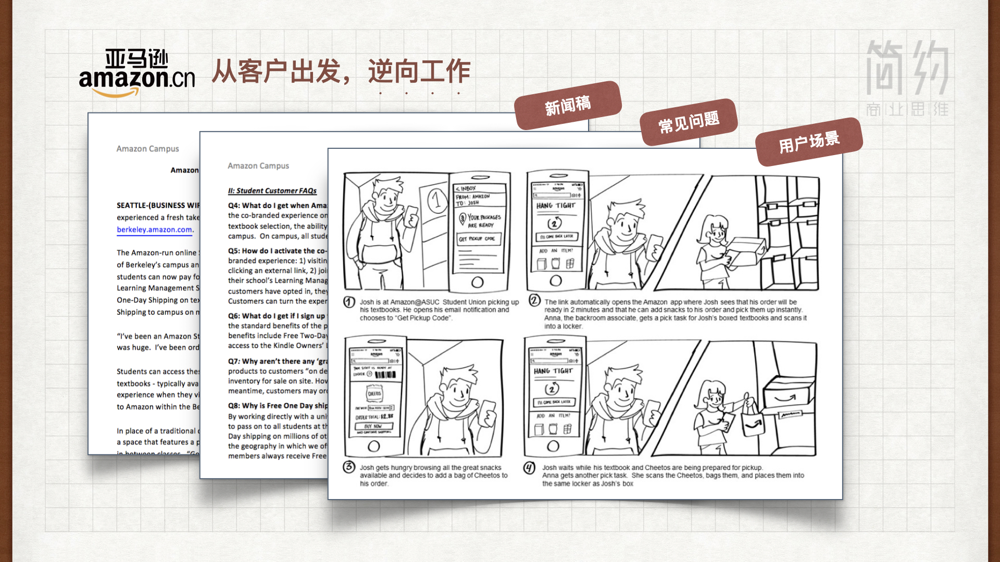

:audio{src="http://jianyuebookmusic.test.upcdn.net/07.%E4%BC%81%E4%B8%9A%E7%9A%84%E6%9C%AC%E8%B4%A8-%E6%88%98%E6%9C%AF%E5%92%8C%E6%88%98%E6%96%97.mp3" controls="controls"}

&#x20;    各位好，我是简约商业思维共创人张正明。本节课的题目是企业的本质，有请徐井宏老师。

&#x20;    企业无论是战略，战术还是战斗，用再一个形象的话讲就叫做**知进退、懂取舍、明得失**。就是我什么时候进，什么时候退，我到底要取什么，然后我要舍弃什么，然后我要得到什么，我要失去什么。知进退，懂取舍，明得失，就是企业决策力。

&#x20;    回到说战术，我说战术上量力而行，那举个形象的说法，比如说人可以有好多状态，我们可以躺着做事，我们可以坐着做事，我们可以站着做事，我们可以踮起脚尖做事，我们可以跳起来做事，我个人认为最好的一个状态就是踮起脚尖做事。但是脚尖一定还挨着地，当然说在这个过程中说偶尔我跳一下是不是可以，是可以的。因为有些机会的来临是你必须要去抓住它，或者在某些竞争下你必须要奋力一跳。但是你不能一直都跳着，当然其实最不好的状态是悬空，悬空总有一天会摔下来，但是说某一个点上我就悬一下，可不可以？是可以的。这都是针对不同的企业和企业的不同的发展阶段，都没有绝对的定义。

&#x20;     其实我的另一个观点就是，企业无论从管理、从运营、从规划都没有绝对的对错，不是说这样就对了，那样就错了，而是什么呢？是有效的才对了，无效的就错了。所以我一直强调企业应该是**结果导向，效率导向**。要为结果服务，然后要有效。所以战略战术制定的时候，一定不要做成空想，而一个很重要的思维就是无论战略、战术还是组战斗的组织，都是为实现一个目标所服务的，所以这个目标的制定，在所有这些思维之前。就还是：我到底希望我成为一个什么样的企业？我到底希望我未来这个企业给这个社会提供什么样的价值？剩下其他的制定，一定是针对这个目标而言，那这个目标可以定的很庞大，这叫战略。在战略上可以定的很庞大，但是在战术上一定是一步一步的走过去的。

&#x20;      所以我曾经说企业没办法，企业有一句话叫“成者王侯败者寇”，即使是同样的路径，即使是同样的方法，有的就成了，有的就败了，他还跟那个时机的把握有巨大的关系，然后和自己在那一刻所做的准备和你持有的武器有很大的关系。所以它是真的运转，虽然我们叫简约商业思维，讲的是思维，但是真的运转会面临各种各样复杂的问题，那这个时候就考验每一个创业者或者企业家他综合素质的能力了，所以简约商业思维其中有另外一个观点，任何一个成功都是一个综合体系的形成，而不是一个单一的因素，单一的因素可能在这个时候起到了一个加速的作用，但是没有综合素质，这单一的因素是没有用的。所以机遇也永远是给有准备的人，机遇也永远是给那些真正奠定了强大基础的企业。那拿我做科技园，刚才我讲了三大战略也好，讲了搭台、铺路、架桥的使命也好，但是实际我们在做的时候，那是一点一滴，每一个时间都不一样把它做起来。比如早期，在刚开始你先要搭一个基础，别管你有多好的理想，你得先把这个园区建设起来，所以在建设阶段如何建好就是核心。我们那个时候也面临巨大的挑战，现在很多写字楼突然空起来了，出租率也不够。我们做那个规划的时候，全北京的写字楼的面积只有100万㎡，但是按照当时北京市的各个园区的规划，要在几年内新生出400万㎡的写字楼，那企业的速度，使用率会不会跟着这个来提高？

&#x20;      那我们那个时候就说到底做不做？其中我一栋大厦叫科技大厦，188000平米，是我们那里的一个主建筑，甚至我们在做那件之前的时候，我的很多同事提出，咱们不能盖这么大，盖这么大投入很高，如果一旦最后的利用率不高的话，我们就会有巨大的风险。但那时候我们还是必须按照这个来做，最后决定还是做这么大。但是我就给了八个字，叫全力以赴，以快致胜。别想别的，我们就用速度来创造我们的优势。

&#x20;      结果到2005年，北京市那时候规划的园区有11个，2000年中规划有11个，大家都说三年五年建成，结果到五年之后只有我们建成了，像中关村西区项目不是说人家不好，他们还没有落成，这个时候我建成了，虽然全北京的规划是400万平米，但是只新出来几十万平米，那我的入住率迅速的就实现了，让我们可以盈利。

&#x20;     我当时建科技大厦我测算了一下，我说如果当年建完之后能够达到30%的入住率，第二年达到50%的入住率，第三年达到80%的入住率，我们大概就可以生存，但是实际第一年我们就达到了80%的入住率，从第二年开始一直到今天都是超100%的入住率，为什么叫超100%？就是这家还没有搬走，那家已经接上了。所以这就是战术，所以战术那时候就是八个字，全力以赴，以快致胜。所以就是快速的把这个局面打开。

【关于战斗----------】

&#x20;     讲战斗中要全力以赴，其实讲的就是执行力，那执行力是什么？其实执行力就指的是如何贯彻你的战略意图，然后完成预定目标的操作能力。其实执行力是企业最核心竞争力的组成，也就是如何把企业的战略战术转化成真正的效益和成果。所以在说到战斗说到执行力，两个导向，结果导向和效率导向。所谓的结果导向就是你能不能够实现你预期的目标。所谓的效率导向，就是你是不是能够真正以最高效的方式来完成你这次战斗所需要的一个结果，企业的执行力大概需要这样一些因素。我们前面说了必须有清晰的一个目标任务，所谓的战略战术的制定，但是光有这个其实也是不够的，他还需要一些其他的要素，比如合理的资源配置，其实企业战略、战术、战斗都是首先需要我们自己有一个充分的信息和准备好的资源，这些资源既包括我们自己的能力，也需要很多很多其他方面的资源，那这些资源如何配置也是检验我们战斗能不能打好，就像一个军队要打好一个仗，你是什么样的武器装备？是迫击炮加重机枪，还就是小米加步枪，如果武器不同，你的战斗的组织一定是不同的。所以当我们组织一个战斗的时候，我们要充分知道自己的武器是什么，然后还要有可行的实施路径，条条大路都通罗马，往往我们会认为最直的那一条是最近的，但是在那条路上可能有很多的高山，你根本攀不过去，或者有很多的坑没能走到，你就掉进去了。所以路径不在于最佳，而在于可行。同时呢，一个更重要的因素就是明确的人员职责。

&#x20;      我说过人永远是我们一切最根本的因素，所以我们每一个岗位，每一个人员能不能做到适配，能不能真正的完成他所需要完成的任务，这是我们一个管理者必须在打响战斗之前就要充分想好的事情，同时也还需要有力的检查督促，健康的企业文化，有效的考核激励等等一系列的这样的措施的安排。

【关于团队----------】

&#x20;    其实这里边无论我们是战略战术，除了各种外部条件，各种考虑，其实最重要高于一切的，其实就是团队的准备和人才的准备。无论事情多么的好，如果人才的准备没有满足，这件事多好，也做不好的，所以所有事都是人做出来的。当年我做辐射发展战略的时候，一个我自己时刻注意强加的因素就是，如果我到任何一个地区去扩展那个司令员，我没有找到的时候，不管那个地方给我零地价，多好的政策，我都不会去，因为没有那样一个人，那个仗就打不好。所以我们自己在这个过程中不断地培养我们的人员，能够对我们的理念，我们的操作方式，我们的因地制宜这些东西都能够有充分的理解。那只有说这员大将，我们觉得准备好了，那到这个地区，到那个地区去拓展。所以人才永远是任何一个企业制定战略战术最核心的一个因素。

【教练解读---------------】

&#x20;    大家好，我是简约商业思维主理人朱天博。我们先来回顾一下企业的本质，就是战略的确立，战术的制定和战斗的组织。战略上我们要倾力前瞻，战术上我们要量力而行，战斗中我们要全力以赴。在战略执行中，首先我们要考虑战术层面，主要是考虑到我们自己的优势与劣势，我们的关键的任务，还有我们组织保障的能力。在战斗层面，我们要细化我们的实施计划。我们继续利用战略之屋这个工具来形象化的认知战略、战术与战斗之间的关系。公司的使命、愿景与价值观是房子的房顶，它代表我们要前往的方向和长期要达成的目标。横梁则代表我们的战略重点和目标，包括了3\~5年的中期战略目标以及未来一年的短期业务目标、战略重点和目标指引我们中短期行动的方向。不同的支柱则代表在制定战术和组织战斗中，各个部门要基于全局目标和部门的关键任务来更好的分工协作和聚焦关键，以最终达成战略目标。而房子的底座则是组织架构、机制、组织文化等作为基础的保障来更好的支持组织达成战略目标。在本节课中，我们提供三个工作表格。

&#x20;      第一个是关键任务简介，目的是提供关键任务的总揽，帮助团队所有人快速的了解有哪些关键任务需要完成，以及关键任务的描述和相关部门和负责人。

&#x20;      第二个表格是关键任务描述，它将提供更多任务的细节，内容包括关键任务的描述、如何达成关键任务的主要举措、衡量目标达成的关键里程碑，以及我们需要与内外部合作伙伴达成什么样的合作关系。每个关键任务都需要详细的设计这样一张表格，并且深度的思考任务与任务之间的逻辑关系以及任务是否能有效地支持团队目标的实现。

&#x20;     第三张表格则是将每一个举措拆解成具体的行动计划，实现责任落实到人，同时做到能够进度的追踪和成果的衡量。行动计划中包括举措的描述，如何衡量这个举措是否完成以及拆解到更细的任务项。在每个任务项当中，需要描述这个任务项的衡量指标、负责人完成日期以及需要什么样的资源与支持。

&#x20;     我们继续来看上一课提到的亚马逊的案例，我们将利用这个案例，借假修真，帮助大家学习课程中三个表格的具体使用方法。首先，我们选取的关键任务是建立客户导向，持续从失败中学习的组织机制与文化。

&#x20;   接下来将这个关键任务拆解为六个关键举措，一、建立逆向工作法流程。二、创建自服务平台。三、雇佣符合建造者、创新者、创业者基因的员工。四、基于亚马逊领导力准则培养团队思维与能力。五、领导者鼓励团队，利用原型频繁进行实验。六、构建双披萨团队。接下来我们来看三个主要举措。

&#x20;     第一，从客户出发，逆向工作。逆向工作法是亚马逊非常著名的一种工作方法，目的是让所有的员工更好的做到以客户为中心的思考。在每一个项目确定后，团队不是立即进行设计与开发，而是首先要设想，当项目完成以后，客户会如何看待我们所产生的成果，并且站在客户角度思考我们要如何交付客户所期待的成果。“逆向工作法”包括了项目完成后所发布的新闻稿、客户关注的常见问题以及从客户角度来展示的使用场景，并以此让团队能够更加聚焦于客户。

&#x20;    第二，自服务平台，没有门卫。正如亚马逊倡导的，我们正在创造强大的自服务平台，是数以千计的人们能够勇敢的实践和实现新事物，而在以前，这是不可能或者代价极高的。自助服务平台，是为了鼓励所有员工能够大胆的进行实验。因此，亚马逊提供自助服务实验环境，让想要进行实验的员工可以很容易的取得实验所需要的计算与网络资源等。

&#x20;      第三，双披萨团队实现敏捷，在亚马逊当中还有一个非常重要的团队工作原则叫做双披萨团队原则。为了更好的鼓励员工的自主性、积极性与责任感，亚马逊规定了一个团队成员的数量不能够超过两个大披萨能够喂饱的人数。

&#x20;     当完成了以上主要举措以后，接下来就是设定衡量目标达成的关键里程碑，以及这个关键任务会和其他合作伙伴什么样的相互协作的关系。在这个例子中，则需要跟平台团队、人力资源团队、项目管理团队共同合作，实现这个关键任务。

&#x20;    最后，这是将一个个的举措展开成具体的行动计划。在这个例子当中，我们提供了诸如表单与流程设计、团队内部的培训等具体的任务供大家做参考。当完成了这三张表格后，我们将能够更好的实现从战略到战术和战斗的落地。

本节课的思考题请结合上一课的练习，继续解构自己公司的关键任务、举措与行动计划，并且分析哪些方面做得好，哪些方面还可以提升。
