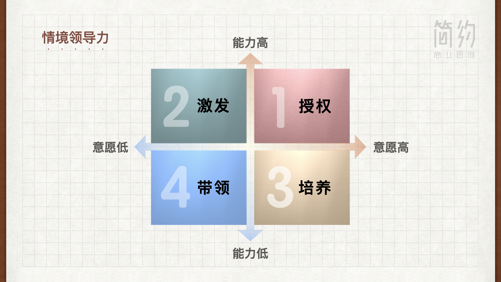

:audio{src="http://jianyuebookmusic.test.upcdn.net/10.%E7%AE%A1%E7%90%86%E7%9A%84%E6%9C%AC%E8%B4%A8-%E6%A6%82%E8%BF%B0.mp3" controls="controls"}

各位好，我是简约商业思维共创人张正明。本节课的题目是管理的本质，有请徐井宏老师。

&#x20;     我们简约商业思维其实倡导的就是一切问题都去抓住它的本质，而不要复杂化，更不要神秘化。其实管理这件事也挺简单的，其实就是管理者运用一定的管理措施来为实现企业的目标而采取的行动。所以管理的核心其实不在于用什么方法，而在于是否有效，所以管理要追求的一个叫做高效，一个叫做有序管理。更不是多么的复杂才好，其实越简单越实用的才是越好的管理。

&#x20;       所以这里两个概念，最小的成本，最高的效率，还要高质量的完成既定的任务。同时其实管理还有另一个功能，就是要最大限度的控制风险，我们知道在企业的运行中会有很多很多不确定性，那如何能够通过管理，用自己确定的方式来把不确定性给它预防掉。所以管理本质上就是四个词叫做：**提质、增效、降耗、控险**。这四件事是否能够做到位，就是检验你的管理是否有效的一个标准。

&#x20;      那么在管理中一个重要的常识是什么呢？就是管理是为实现企业的目标而进行，任何脱离目标的管理都是没有意义的。从这一点上来讲，其实管理不是越细致越复杂就越好，还是我刚才讲的越有效才越好。比如说我们在制定一些制度或者流程，我觉得能够两个人签字就解决的事，你就不要非要三个人甚至五个人，而是把它整个的效率提高到最高。所以管理就是通过**计划、组织、协调、激励、控制**这样五个手段，把人及一切资源来搭配好、安排好、执行好。

&#x20;      那我们可能在这一两年会出现很多新的词汇，告诉我们管理要发生颠覆性变化，如何数字化管理。我个人认为一切的技术其实都是手段，无论是互联网还是数字等等，它都是一种技术，那要把管理做的更好，其实就是如何把这些技术应用到管理之中，做的更加准确，更加高效。

&#x20;      管理的关键实际对一个公司来讲就是要运行好三个系统，分别叫**决策系统、执行系统和管控系统**。从人的角度管理就是既要能够充分发挥出每一个人的积极性、创造性和他的潜能，同时又要保证所有人大家一起朝着一个目标一个方向去前进。那这里我想提醒一件事，一个企业的领导人其实有一个重要的素质，就是永远不要用情绪去做事，要能够做到很好的自我控制，一切和企业相关的事都要去经过科学的判断和研究来做出你的决策和管理。

&#x20;      同时领导还要控制自己，管理有一个bug，就是永远不要越级指挥，可以听越级的汇报，但是不要越级指挥，一旦越级指挥，这个管理就是无序的，其实我们有一些领导会犯这样的毛病，那么我过去曾经说过，创业有五忌，今天我也说说管理的五忌，分别叫做:

一忌无地放矢，就是管理一定要为目标而服务。

二忌责权不明，其实管理就是授权，就是职责的分解，那这个一定要清晰。

三忌求全责备，管理不是越细越好，越复杂越好，而是越可行越好，我叫做不求完美求可行。

四忌越级指挥。

五忌随心所欲。

&#x20;      一个企业领导人一定要做好自我控制，要能够指挥若定的来推行你在企业的管理。

张正明：徐老师刚才提到管理是为了目标而服务，这让我联想到一个企业，当一个企业大的时候，职能部门开始变多，有HR部门，财务部门，风险管控部门等等等，那这些职能部门为了要提升它的工作绩效，它就会设定了很多的绩效目标，很多的规章制度去做企业的运营管理。

徐井宏：管理大家记住核心两个词，一叫有序，二叫高效。这两个有任何一个偏颇，其实都不是好的管理。

&#x20;     张正明： 徐老师，刚才您讲到管理有五大要素，那在日常的工作当中，哪个要素是比较重要的呢？

&#x20;     徐井宏：其实我们说管理的本质就五件事做好：计划、组织协调、激励、控制。我觉得这五件事是五位一体的，其实是不可以分割来看的，一定是把它们紧密的联系在一起，共同的来考虑。当然在不同的时期，不同的月份，它的重点不同，那就看一个管理者如何来安排自己工作的节奏。

【教练解读--------】

&#x20;   大家好，我是简约商业思维主理人朱天博。

&#x20;  徐井宏老师在《简约商业思维》中提到，管理的本质就是用计划、组织、协调、控制和激励这五个手段，把人和资源来搭配好、安排好、执行好，最终达到提质、增效、降耗、控险的目标。

&#x20;   那这五个手段是五位一体的，我们不可以分开来看的。

&#x20;   举一个例子，比如在创业的初期，我们要计划开发一款红外测温的产品，提供给商场去检测所有客人的体温，那首先我们就需要做好市场调研的计划和产品开发的计划，并且要确保计划的可行性。那接下来要搭建支持计划实现的组织，那包括调研小组、产品经理和产品开发小组，以及确保大家的有效的分工和协作。然后我们还需要确保不同团队的行动是协调一致的，基于心往一处想，力往一处使。并且做到及时的反馈、及时的复盘和及时的改进。我们也需要定期的对目标达成的进度进行追踪和评估，把控项目的质量与时效，确保在预算内高效的完成目标。最后，我们还要利用好激励机制来调动和激发团队的积极性和能动性。

&#x20;    而做好管理的关键就是要运行好决策系统、执行系统和管控系统这样三个系统。

&#x20;    决策系统就是对战略、战术和战斗来进行决策。常见的业务活动包括战略规划、会议目标设定、会议项目立项或投资决策，以及如何设计、组织和配置人员以及资源等等。

&#x20;    执行系统是要一步一步的推动战略落地和目标的实现，包括支持个人与项目执行所需要的流程、激励机制和考核制度以及保障措施等。那常见的业务活动就包括项目管理团队与个人目标的跟踪与考核、预算管理、质量管理等等。

&#x20;    管控系统则是要通过相应的一些的措施、流程、制度，监督、检查等来实现企业以最小的成本，最高的效率，最好的质量来完成我们的目标。那同时呢，管控还有另外的一个任务，就是要最大限度的降低企业的风险，常见的业务活动包括战略方向的控制，财务的控制，流程的控制，绩效的控制和风险的控制。

&#x20;    管理也有五忌，分别是无的放矢、权责不明、求全责备、越级指挥和随心所欲。

&#x20;    其中无的放矢，随心所欲和求全责备这三忌是从领导者的素养层面我们应该去避免的。而权责不明和越级指挥只是从领导者的能力层面也要让我们引以为戒的。无的放矢就是没有目标乱射箭，说话做事没有明确的目的，或者看对象，以及不结合实际，盲目乱来。随心所欲：只是一切都由着自己的心意，想怎么做就怎么做。而求全责备则是对人对事要求都要十全十美，甚至毫无缺点，那管理并不是越细越好，越复杂越好，而是越可行越好。正如徐老师在简约商业思维中所倡导的，叫做不求完美求可行。

&#x20;    另外两忌则是权责不明和越级指挥。我们有很多领导者，经常会出现见到谁就临时的抓差来安排工作，导致一项工作有多人来负责，那有了成绩就会出现，大家争着邀功，而一旦出了问题，大家又会互相推卸责任。那同时，领导者还往往为了追求工作的效率，亲自上手，亲力亲为，而忽略了持续培养下属团队能力的重要性，同时也会导致中间的管理层被架空，发挥不了价值，同时也挫伤了他的积极性。

&#x20;     因此，领导者要更好的来发展自身的情境领导力。那什么是情境领导力呢？就是领导者要依照团队的能力和意愿来实施不同的领导策略。能力是团队成员是否有知识、经验和匹配的技能。意愿是指团队成员是否有自信心，承诺与内驱力去工作。当团队有意愿又有能力来完成任务时，领导者应该积极的授权团队的成员来独立的进行工作的决策，提供资源和一些条件的支持，并且让成员全权负责并独立完成工作。当团队意愿低却有能力来完成任务时，领导者应该与团队共同面对问题以及帮助制定解决方案并给予鼓励与支持，称赞工作表现，褒奖并帮助其建立自信心。当团队意愿高却缺乏能力来完成任务时，领导者应该解释其决策，并且给予团队进行澄清的机会，密切观察团队成员的工作的成效，并对于行为与成果给予反馈，帮助成员提升其能力。最后，如果团队意愿低，也缺乏能力来完成工作。这领导者应该做主要的决策和规划，并向团队来诠释工作的目标、细节、方法。领导者一步一步指导团队成员来完成任务。如果这样团队还是没有办法完成工作任务时，领导者需要采取必要的行动来去匹配更适合的团队来承接工作任务。

&#x20;    本节课的思考题请利用情景领导力的四个维度来分析自己目前在带领团队时是否有效的采取了不同的领导策略来领导团队实现工作任务，还有哪一些可以提升的地方？
